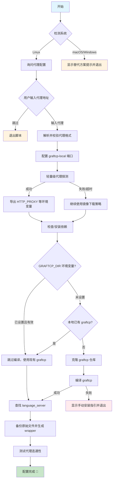

# WSL 环境下流量劫持失效，无法接管 Linux 子系统内的网络请求

## 问题

```
环境信息 (Environment):

OS: Windows 11

WSL Mode: Antigravity 连接本地 WSL 实例

Log Time: 2026-01-09

问题描述: 作者好，感谢开发这个工具。在使用过程中发现，当在 Windows 本地直接运行 Antigravity 时，代理工作正常。但当 Antigravity 连接到 本地 WSL 作为后端环境时，流量劫持失效，导致无法加载模型。

日志分析: 查看日志发现，代理程序识别到了 wsl.exe 进程，但将其跳过，未进行注入。 这是符合预期的，因为 version.dll 劫持技术无法注入到 WSL 内
部运行的二进制程序中，也无法 Hook WSL 内部发出的网络请求。

相关日志片段如下：

[2026-01-09 15:35:13] [PID:10312][TID:9076] [信息] [跳过] 非目标进程(仅首次记录): prefetch:11 (PID: 35880)
...
[2026-01-09 15:35:13] [PID:20912][TID:11892] [信息] [跳过] 非目标进程(仅首次记录): wsl.exe (PID: 3660)
...
[2026-01-09 15:36:13] [PID:15372][TID:26636] [信息] [跳过] 非目标进程(仅首次记录): wsl.exe (PID: 18396)

原因推测: Antigravity 在 WSL 模式下(我是在左侧的远程资源管理器中连接wsl)，核心业务逻辑运行在 WSL 的 Linux 环境中。目前的 DLL 劫持方案只能接管 Windows 层的 Socket 调用，无法触及 WSL 内部流量，导致这部分流量直连。貌似是他会在WSL下创建一个language server然后通过SSH连接。

期待回复，感谢！
```


## 参考资料

- [反重力代理配置工具](https://github.com/ccpopy/antissh)
- [Antigravity 在 wsl 中运行的话通过 proxifier 设置的.exe 代理好像没用啊](https://www.v2ex.com/t/1174113)

---

# 反重力代理配置工具

> https://github.com/ccpopy/antissh

为 反重力 Agent 配置代理，解决网络连接问题。

## 系统支持

| 系统        | 支持情况      | 说明                           |
| ----------- | ------------- | ------------------------------ |
| **Linux**   | 支持          | 使用 graftcp 自动代理（脚本为 Bash，需 Bash >= 4） |
| **macOS**   | 不支持        | graftcp 依赖 Linux 的 `ptrace`，推荐使用 Proxifier 或 TUN 模式 |
| **Windows** | 不支持        | 推荐使用 Proxifier 或 TUN 模式；WSL 可按 Linux 方式使用 |

## Linux 使用方法

### 1. 下载脚本

```bash
curl -O https://raw.githubusercontent.com/ccpopy/antissh/main/antissh.sh
# 或者国内加速下载
# curl -O https://ghproxy.net/https://raw.githubusercontent.com/ccpopy/antissh/main/antissh.sh
chmod +x antissh.sh
```

### 2. 运行脚本

```bash
bash ./antissh.sh
```

### 3. 脚本执行流程



### 4. 按提示操作

脚本会依次：

- 询问是否需要配置代理
- 输入代理地址，格式如下：
  - SOCKS5: `socks5://127.0.0.1:10808`
  - HTTP: `http://127.0.0.1:10809`
- 配置 graftcp-local 监听端口（默认 2233，多用户环境可自定义）
- 自动安装依赖和编译 graftcp
- 自动查找并配置 language_server

### 5. 修改代理

直接重新运行脚本即可更新代理设置。

### 6. 恢复原始状态

```bash
mv /path/to/language_server_xxx.bak /path/to/language_server_xxx
```

路径会在脚本执行完成后显示。

### 7. 多用户环境（服务器场景）

graftcp-local 服务需要监听一个本地端口（默认 2233）。在多用户共享服务器环境下，不同用户需要使用不同的端口以避免冲突。

脚本会在运行时询问端口配置：

```
请输入端口号（默认 2233，直接回车使用默认）: 2234
```

- **直接回车**：使用默认端口 2233
- **输入其他端口**：使用指定的端口（如 2234、2235 等）

端口冲突处理：

- 如果端口被其他 graftcp-local 服务占用 → 复用该服务
- 如果端口被其他进程占用 → 提示重新输入

### 注意

IDE 升级后可能会在 `~/.antigravity-server/bin/` 下新增版本目录，导致之前配置的代理失效。

**解决方法（二选一）：**

1. **推荐**：直接重新运行脚本，脚本会自动检测新目录并重新配置
2. **手动迁移**：
   - 进入新目录 `~/.antigravity-server/bin/<新版本号>/extensions/antigravity/bin/`
   - 将 `language_server_linux_*` 重命名为 `language_server_linux_*.bak`
   - 将原目录中的 wrapper 脚本（即之前配置的 `language_server_linux_*`）复制到新目录

### 注意事项

- **端口配置复用**：wrapper 脚本中保存了完整的配置（包括端口）。IDE 升级后，直接将旧 wrapper 复制到新目录即可保持端口配置不变
- **重新运行脚本**：如果选择重新运行脚本，需要再次输入相同的端口号

### WSL 网络配置（Mirrored 模式）

如果你在 WSL 中使用本脚本，建议开启 **Mirrored 网络模式**，这样 WSL 可以直接使用宿主机的代理（127.0.0.1）。

**配置方法：**

1. 在 Windows 用户目录下创建或编辑 `.wslconfig` 文件：

```ini
# %USERPROFILE%\.wslconfig
[wsl2]
networkingMode=mirrored
```

2. 重启 WSL：

```powershell
wsl --shutdown
```

3. 重新进入 WSL 后，代理地址可直接使用 `127.0.0.1`：

```bash
# 例如
socks5://127.0.0.1:10808
http://127.0.0.1:10809
```

> **注意**：Mirrored 模式需要 Windows 11 22H2 及以上版本，且 WSL 版本 >= 2.0.0。
>
> 如果不使用 Mirrored 模式，需要使用 WSL 虚拟网卡的网关 IP（通常是 `cat /etc/resolv.conf` 中的 nameserver 地址）。

---

## macOS / Windows 替代方案

由于 graftcp 依赖 Linux 的 `ptrace` 系统调用，在 macOS/Windows 上无法使用。

### 推荐方案 1：Proxifier（推荐）

1. 下载安装 [Proxifier](https://www.proxifier.com/)
   - 关于 license key，请自行搜索，有特别版序列号，如有能力请支持正版
2. 添加代理服务器：
   - `Profile` → `Proxy Servers` → `Add`
   - 填入你的代理地址
3. 添加规则：`Profile` → `Proxification Rules` → `Add`
   - 应用程序添加以下内容（根据系统选择）：
     - macOS: `com.google.antigravity.helper; com.google.antigravity; Antigravity; language_server_macos_arm; language_server_macos_x64`
     - Windows: `language_server_windows_x64.exe; Antigravity.exe`
   - Action 选择刚添加的代理

### 推荐方案 2：TUN 模式

使用 Clash、Surge 等工具开启 TUN 模式，实现全局透明代理。

### 方案 3：环境变量（不推荐）

Agent 服务可能无法走代理，仅供参考：

```bash
export ALL_PROXY=socks5://127.0.0.1:10808
export HTTPS_PROXY=http://127.0.0.1:10809
```

---

## 依赖要求

- **Go**: >= 1.13（脚本会自动安装）
- **Git, Make, GCC**（脚本会自动安装）

## 鸣谢

- [graftcp](https://github.com/hmgle/graftcp)
- [思路来源](https://www.v2ex.com/t/1174113)

### 特别感谢

<a href="https://github.com/ccpopy/antissh/graphs/contributors">
  
</a>

## Star History

[](https://www.star-history.com/#ccpopy/antissh&type=date&legend=top-left)

---

# Antigravity 在 wsl 中运行的话通过 proxifier 设置的.exe 代理好像没用啊

> 起来时 wsl2 里面的扩展自行发起的连接请求。 .antigravity-server/bin/afdb915a7890576374cec17dccf6d91249170a86/extensions/antigravity/bin/language_server_linux_x64

